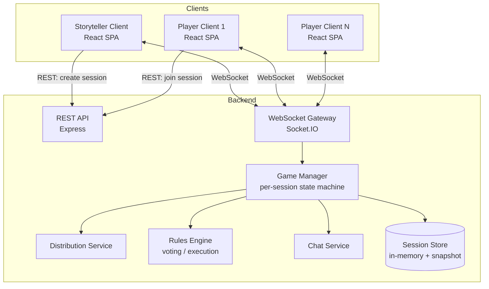

# Design Document

## Overview

The application is a real-time, multi-client web app for running a *Blood on the Clocktower* (Trouble Brewing script) game session online. One client is the **Storyteller** (full game-master view); the rest are **Player** clients (character-scoped view). A **Node.js/TypeScript backend** owns all authoritative game state and enforces information-hiding (Grimoire data, other players' identities, and Evil chat are never sent to unauthorized clients). A **React/TypeScript frontend** renders role-specific screens and communicates over WebSockets for real-time sync, with REST for one-shot actions (create/join session).

Given the info-hiding and low-latency multiplayer requirements (Requirements 3.6-3.7, 4.2-4.3, 6.1-6.2, 8.1), the architecture is server-authoritative: clients never compute or store secrets they aren't entitled to, and the server filters every outbound payload per-recipient rather than relying on the client to hide data it already has.

## Architecture



### Technology choices

- **Frontend**: React + TypeScript (Vite), React Router for view routing (`/host`, `/play/:code`, `/storyteller/:code`), a WebSocket client hook (`useGameSocket`) wrapping reconnect/backoff logic, CSS with a theme file (design tokens) for the gothic aesthetic.
- **Backend**: Node.js + TypeScript, Express for REST endpoints, `socket.io` for WebSocket transport (chosen over raw `ws` for built-in room support, auto-reconnect, and acknowledgements, which directly support Requirement 8).
- **State storage**: In-memory per-session store (a `Map<sessionCode, GameSession>`) is sufficient for the scope (ephemeral game sessions, no persistence requirement in the spec). Each session also periodically snapshots to allow process-restart recovery in a single-instance deployment; horizontal scaling is out of scope.
- **Validation**: `zod` schemas shared (via a `shared` package/folder) between client and server for request/message payload shapes, so both sides agree on structure without duplicating type definitions.

## Monorepo / Package Structure

```
clocktower-web-app/
  packages/
    shared/         # TypeScript types, zod schemas, script/character data, distribution table
    server/         # Express + Socket.IO backend
    client/         # React + Vite frontend
```

`shared` holds no framework code — just types, constants (character definitions, distribution table, night order), and validation schemas — so both `server` and `client` import from it without duplication.

## Components and Interfaces

### 1. Session & Player Management (`server/session`)

**`GameSession`** (server-side, authoritative, never fully serialized to any single client):

```typescript
interface GameSession {
  code: string;                 // join code, e.g. "FX7K2"
  storytellerConnectionId: string | null;
  phase: 'lobby' | 'day' | 'night' | 'ended';
  dayNumber: number;             // 0 before first day
  script: 'trouble-brewing';
  players: Map<string, PlayerRecord>;  // key: playerId
  nomination: ActiveNomination | null;
  createdAt: number;
  lastActivityAt: number;
}

interface PlayerRecord {
  playerId: string;              // stable id, survives reconnect
  connectionId: string | null;   // current socket id, null if disconnected
  displayName: string;
  character: CharacterId | null; // null until distribution
  characterType: 'townsfolk' | 'outsider' | 'minion' | 'demon' | null;
  alignment: 'good' | 'evil' | null;
  alive: boolean;
  usedDeadVote: boolean;         // Requirement 5.5
  statusEffects: { poisoned: boolean; drunk: boolean; protected: boolean };
  hasNominatedToday: boolean;
  onboardingSeen: boolean;       // persisted client-side too (Requirement 7.5)
}
```

**Session Manager responsibilities**:
- Generate unique join codes (retry on collision), enforce min/max player counts (Requirement 1.1, 1.7, 1.8).
- Track `playerId` via a signed token stored client-side (e.g. in `localStorage`) so a browser refresh or reconnect resolves to the same `PlayerRecord` (Requirement 8.2-8.3) rather than creating a duplicate player.
- Idle session cleanup (e.g. sessions inactive > N hours are garbage-collected) — reasonable default for an ephemeral game, not explicitly required but needed to bound memory.

**REST endpoints**:

| Method | Path | Purpose |
|---|---|---|
| POST | `/api/sessions` | Create session; returns `{ code, storytellerToken }` |
| POST | `/api/sessions/:code/join` | Join with `{ displayName }`; returns `{ playerToken, playerId }`. Validates Requirement 1.3-1.5, 1.8 |
| GET | `/api/sessions/:code` | Lightweight lookup for pre-join validation (exists? lobby open? player count?) |

All subsequent interaction happens over WebSocket using the issued token for auth.

### 2. WebSocket Protocol (`shared/protocol`, `server/gateway`)

Socket.IO rooms are used to scope broadcasts:
- Room `session:{code}` — all clients in that session (used for phase changes, public nomination/vote events).
- Room `session:{code}:evil` — Evil-aligned players + Storyteller (Evil chat, Requirement 6).
- Direct-to-socket emits — used for anything player-specific (own character reveal, ability results).

**Client to Server events** (validated via shared zod schemas):

| Event | Payload | Requirement(s) |
|---|---|---|
| `auth` | `{ token }` | Reconnect / identify (8.3) |
| `storyteller:startDistribution` | `{}` | 2.1 |
| `storyteller:redistribute` | `{}` | 2.7 |
| `storyteller:setPhase` | `{ phase: 'day' or 'night' }` | 3.3 |
| `storyteller:setPlayerStatus` | `{ playerId, statusEffects }` | 3.2 |
| `storyteller:markDead` | `{ playerId }` | 3.4, 5.8 |
| `storyteller:shareAbilityResult` | `{ playerId, text }` | 4.6 |
| `player:nominate` | `{ targetPlayerId }` | 5.1, 5.2 |
| `player:vote` | `{ nominationId, voting: boolean }` | 5.4, 5.5 |
| `storyteller:closeVote` | `{ nominationId }` | 5.6, 5.7 |
| `storyteller:confirmExecution` | `{ nominationId }` | 5.8 |
| `chat:evil:send` | `{ text }` | 6.3 |

**Server to Client events**:

| Event | Audience | Payload | Requirement(s) |
|---|---|---|---|
| `lobby:update` | session room | `{ players: {id, displayName}[] }` | 1.6 |
| `game:distributed` | per-recipient (filtered) | see Data Models section below | 2.5, 2.6, 2.8 |
| `game:phaseChanged` | session room | `{ phase, dayNumber }` | 3.3, 4.4 |
| `grimoire:update` | Storyteller only | full player list w/ characters + statuses | 3.1, 3.6 |
| `player:selfUpdate` | per-recipient | own status/ability result changes | 4.5, 4.6 |
| `nomination:opened` | session room | `{ nominationId, nominatorId, targetId, votes: [] }` | 5.3 |
| `nomination:voteUpdate` | session room | `{ nominationId, votes: [{playerId, voting}], tally }` | 5.4 |
| `nomination:closed` | session room | `{ nominationId, pendingExecution: boolean }` | 5.6, 5.7 |
| `execution:confirmed` | session room | `{ playerId }` | 5.8 |
| `chat:evil:message` | evil room | `{ senderId, text, ts }` | 6.3, 6.4 |
| `chat:evil:history` | evil room (on join) | `{ messages: [...] }` | 6.6 |
| `error` | requesting client | `{ code, message }` | 9.5 |

Every server-to-client emit that could carry secret data is constructed by a **per-recipient filter function**, not by broadcasting one shared object — this is the mechanism that satisfies the "never leak" acceptance criteria (2.6, 3.6-3.7, 4.2-4.3, 6.1-6.2). See the Information-Hiding Model section below.

### 3. Distribution Service (`server/distribution`)

Implements Requirement 2. Pure functions live in `shared/script-data`:

```typescript
// shared/script-data/troubleBrewing.ts
export const DISTRIBUTION_TABLE: Record<number, { townsfolk: number; outsider: number; minion: number; demon: number }> = {
  5:  { townsfolk: 3, outsider: 0, minion: 1, demon: 1 },
  6:  { townsfolk: 3, outsider: 1, minion: 1, demon: 1 },
  7:  { townsfolk: 5, outsider: 0, minion: 1, demon: 1 },
  8:  { townsfolk: 5, outsider: 1, minion: 1, demon: 1 },
  9:  { townsfolk: 5, outsider: 2, minion: 1, demon: 1 },
  10: { townsfolk: 7, outsider: 0, minion: 2, demon: 1 },
  11: { townsfolk: 7, outsider: 1, minion: 2, demon: 1 },
  12: { townsfolk: 7, outsider: 2, minion: 2, demon: 1 },
  13: { townsfolk: 9, outsider: 0, minion: 3, demon: 1 },
  14: { townsfolk: 9, outsider: 1, minion: 3, demon: 1 },
  15: { townsfolk: 9, outsider: 2, minion: 3, demon: 1 },
};

export const TROUBLE_BREWING_CHARACTERS: CharacterDefinition[] = [ /* 13 Townsfolk, 4 Outsiders, 4 Minions, 1 Demon */ ];
```

`distributeRoles(session)`:
1. Validate `players.size` is in `[5, 15]` (else throw a typed `DistributionRangeError`, mapped to the `error` event, Requirement 2.2).
2. Look up the type counts for `N` from `DISTRIBUTION_TABLE`.
3. For each type, randomly sample without replacement from that type's character pool (Fisher-Yates shuffle then slice) — Requirement 2.3.
4. Shuffle the flattened list of selected characters and zip 1:1 with a shuffled player list — Requirement 2.4.
5. Write `character`, `characterType`, `alignment` onto each `PlayerRecord`.
6. Compute Evil-team bluffs: for each Evil player, select 3 unused Townsfolk names (standard BOTC convention) not in play, attached to that player's private payload only (Requirement 4.2).
7. Emit `game:distributed`, filtered per recipient (Storyteller gets everything; each player gets only their own record plus evil-teammates-and-bluffs if evil), then `game:phaseChanged` to `day`, `dayNumber: 1`.

Re-roll (`storyteller:redistribute`, Requirement 2.7) simply re-runs the same routine before the session leaves `lobby`; it's disabled once phase has advanced past `lobby`.

### 4. Rules Engine, Voting and Execution (`server/rules`)

Implements Requirement 5 as a small state machine attached to the session:

```typescript
interface ActiveNomination {
  id: string;
  nominatorId: string;
  targetId: string;
  votes: Map<string, boolean>;  // playerId -> voting yes/no
  openedAt: number;
  closed: boolean;
}
```

- `nominate(session, nominatorId, targetId)`: guards nominator alive, nominator hasn't nominated today (`hasNominatedToday`), target alive, and that no other nomination is currently open (sequential nominations, matching how the physical game runs one execution vote at a time). Sets `hasNominatedToday = true`.
- `vote(session, nominationId, playerId, voting)`: guards nomination open, and voter alive OR (voter dead AND not `usedDeadVote`). On a dead player's yes-vote, set `usedDeadVote = true` immediately (Requirement 5.5), a one-way flag regardless of later retraction, matching table-rules convention that using your ghost vote is consumed on use.
- `closeVote(session, nominationId)` (Storyteller-triggered): tally yes-votes, compare against `ceil(livingPlayers / 2)` per Requirement 5.6, compare this nominee's tally against any other qualifying nominee resolved earlier that day to detect ties per 5.7, and mark `pendingExecution`.
- `confirmExecution(session, nominationId)` (Storyteller-triggered, a separate step so the Storyteller retains narrative control over timing): set `alive = false` on the target, broadcast `execution:confirmed`.
- `advancePhase(session, 'day')`: reset `hasNominatedToday` for all players and clear `nomination` (Requirement 5.9); lifetime `usedDeadVote` is left untouched.

### 5. Chat Service (`server/chat`)

- On distribution completion, compute the Evil room membership (`session:{code}:evil`) as all players with `alignment === 'evil'` plus the Storyteller connection, and join those sockets to that Socket.IO room.
- `chat:evil:send`: server validates the sender is in the evil room (defense in depth beyond room membership, re-checking `alignment` server-side) before broadcasting `chat:evil:message` to the room (Requirement 6.1-6.4).
- Message history for the session is retained server-side in a bounded ring buffer (e.g. last 200 messages) per session and replayed via `chat:evil:history` when an evil-aligned socket (re)joins the room (Requirement 6.6).
- If a future script character changes alignment mid-game (Requirement 6.5), the room membership update is just: leave/join the affected socket to `session:{code}:evil` at the moment the Storyteller applies that status change; this hook exists in the design even though Trouble Brewing's specific alignment-changing edge cases are not implemented as automated logic per the Storyteller-driven-night-actions scope decision, so the Storyteller manually triggers `storyteller:setPlayerAlignment` if a character effect calls for it.

### 6. Onboarding Content (`client/onboarding`, `shared/content`)

Static content module (not server state) implementing Requirement 7:

```typescript
// shared/content/onboarding.ts
export const THEME_STEP = { title: 'On the Stroke of Midnight...', body: '...' };
export const GOAL_STEP_GENERIC = { good: '...', evil: '...' };
export const CORE_RULES = [
  'Talk freely, whenever you want.',
  'Do not peek at anyone else\'s character or the Grimoire.',
  'Ask the Storyteller anything, that is what they are there for.',
  'Play kindly. Win or lose with grace.',
];
```

- `OnboardingModal` (client component) renders Theme, then Goal, then Rules as three steppable panels shown on first join.
- Completion flag stored in `localStorage` (`botc:onboarding:seen`), matching Requirement 7.5's "per device" wording; a "Rules" button in the game header re-opens it anytime (7.6), alongside a "My Character" reference panel that pulls the current player's ability text from `shared/script-data`.
- Goal step reads from `GOAL_STEP_GENERIC` if `alignment === null` (pre-distribution), or a specific string derived from the player's own alignment once known (Requirement 7.3).

### 7. Information-Hiding Model (cross-cutting)

Because leaking secret state is the most severe class of bug for this app, filtering is centralized rather than left to each call site:

```typescript
// server/gateway/broadcast.ts
function buildDistributionPayload(session: GameSession, recipientId: string): DistributedPayload {
  if (recipientId === STORYTELLER) {
    return { role: 'storyteller', grimoire: fullGrimoire(session) };
  }
  const player = session.players.get(recipientId)!;
  const base = { role: 'player', character: player.character, characterType: player.characterType, alignment: player.alignment, ability: getAbilityText(player.character) };
  if (player.alignment === 'evil') {
    return { ...base, teammates: evilTeammatesOf(session, recipientId), bluffs: computeBluffs(session) };
  }
  return base;
}
```

Every socket emit that could carry player-specific data goes through a `sendToPlayer(session, playerId, eventName, payloadBuilder)` helper rather than `io.to(room).emit(...)` with one shared object, except for events already verified to be safe for the whole room (phase changes, public vote tallies, chat within the correctly-scoped room). This gives a single audited code path for Requirements 2.6, 3.6-3.7, 4.2-4.3.

## Data Models

### Character Data (Trouble Brewing, `shared/script-data/troubleBrewing.ts`)

Each `CharacterDefinition`:

```typescript
interface CharacterDefinition {
  id: string;               // e.g. 'washerwoman'
  name: string;
  type: 'townsfolk' | 'outsider' | 'minion' | 'demon';
  alignment: 'good' | 'evil';
  ability: string;          // rules text, from the official character sheet
  firstNightOrder: number | null;
  otherNightOrder: number | null;
}
```

The full 13 Townsfolk / 4 Outsiders / 4 Minions / 1 Demon roster (Washerwoman, Librarian, Investigator, Chef, Empath, Fortune Teller, Undertaker, Monk, Ravenkeeper, Virgin, Slayer, Soldier, Mayor, Butler, Drunk, Recluse, Saint, Poisoner, Spy, Scarlet Woman, Baron, Imp) is populated verbatim from bloodontheclocktower.com's published Trouble Brewing character sheet and night-order reference, satisfying Requirement 3.5's night-order display and Requirement 4.1's ability text. Each character's raw ability logic (e.g. what the Empath actually learns) is not computed by the server, consistent with the Storyteller-driven-night-actions scope: the Storyteller reads the printed ability, determines the result manually, and pushes it via `storyteller:shareAbilityResult`.

### Session Store

In-memory `Map<string, GameSession>` inside the Node process. A lightweight JSON snapshot (`session.toJSON()`) is written to disk (or an in-memory backup map) on every mutating event and reloaded on process start, purely so a backend restart during a live game doesn't destroy the game. This is a resilience nice-to-have layered on top of Requirement 8, not a durability guarantee, which is acceptable given the ephemeral, single-deployment nature of casual game sessions.

## Frontend View Structure

```
client/src/
  routes/
    HomePage.tsx            # create or join
    LobbyPage.tsx            # both storyteller and player see lobby, role-gated content
    StorytellerGamePage.tsx  # Grimoire, phase controls, night order, ability-result input
    PlayerGamePage.tsx       # character card, day/night indicator, nominate/vote, evil chat if applicable
  components/
    onboarding/OnboardingModal.tsx
    grimoire/GrimoireTable.tsx
    character/CharacterCard.tsx      # alignment-colored, type badge (Requirement 9.2-9.3)
    voting/NominationBar.tsx
    voting/VoteTally.tsx
    chat/EvilChatPanel.tsx
    shared/ErrorToast.tsx            # Requirement 9.5
  hooks/
    useGameSocket.ts          # connect, auth, reconnect/backoff, typed event subscriptions
    useSession.ts              # derived, role-aware state from socket events
  theme/
    tokens.css                 # gothic palette, typography, clocktower iconography (Requirement 9.1)
```

Responsive layout (Requirement 9.4) uses CSS Grid/Flexbox with breakpoints; the Storyteller's Grimoire table collapses to a card list under about 768px width; the player's action bar (nominate/vote/chat tabs) becomes a bottom tab bar on mobile widths.

## Error Handling

- All REST endpoints return a structured `{ error: { code, message } }` body on 4xx, with HTTP status codes matching the failure (404 unknown code, 409 name taken, 422 validation, 403 unauthorized).
- All WebSocket handlers wrap logic in a try/catch that emits a typed `error` event back to the originating socket only (`{ code: 'NOMINATION_ALREADY_MADE', message: '...' }`) rather than throwing uncaught, so one bad request can't crash the game loop for the whole session.
- Client-side, a single `ErrorToast` subscribes to the `error` event and to REST error responses, mapping known `code`s to the friendly copy required by Requirement 9.5 (e.g. `INVALID_JOIN_CODE` maps to "That code doesn't match an active game. Double-check with your Storyteller.").
- Distribution-range violations (Requirement 2.2), duplicate names (1.4), invalid codes (1.5), dead-player nomination attempts (5.*), and unauthorized Grimoire/chat access (3.7, 6.2) are all modeled as named error codes rather than generic exceptions, so the design's acceptance-criteria mapping stays traceable end to end.

## Correctness Properties

These invariants must hold at all times and are the primary target of the unit/integration tests above:

### Property 1: Information hiding
No outbound payload to a Good-aligned player's socket ever contains another player's `character`, `characterType`, or `alignment` field. No outbound payload to any non-Storyteller socket ever contains the full Grimoire.

**Validates: Requirements 2.6, 3.6, 3.7, 4.2, 4.3**

### Property 2: Single character per player
After distribution, every joined player has exactly one `character`, and every selected character is assigned to exactly one player (a bijection between players and the sampled character set).

**Validates: Requirements 2.3, 2.4**

### Property 3: Distribution count correctness
For any N in [5, 15], the sum of assigned Townsfolk, Outsiders, Minions, and Demons equals N, and matches `DISTRIBUTION_TABLE[N]` exactly.

**Validates: Requirements 2.1, 2.2**

### Property 4: Vote/execution consistency
A player can only be marked executed as a direct result of `confirmExecution` following a `closeVote` that flagged `pendingExecution`; a tie among qualifying nominees never results in an execution.

**Validates: Requirements 5.6, 5.7, 5.8**

### Property 5: Dead-vote consumption
`usedDeadVote` transitions from false to true at most once per player per game, and only via a vote cast while `alive === false`.

**Validates: Requirements 5.5**

### Property 6: Nomination-per-day limit
`hasNominatedToday` blocks a second nomination by the same player until the next `advancePhase(session, 'day')` call resets it.

**Validates: Requirements 5.2, 5.9**

### Property 7: Evil chat isolation
The set of sockets that receive any `chat:evil:*` event is always exactly {sockets of players with `alignment === 'evil'`} union {the Storyteller socket}, re-derived on every alignment or connection change rather than cached indefinitely.

**Validates: Requirements 6.1, 6.2, 6.4, 6.5**

### Property 8: Reconnect idempotency
Re-authenticating with a valid existing `playerToken` never creates a second `PlayerRecord` and always restores the same `playerId`'s state.

**Validates: Requirements 8.2, 8.3**

## Testing Strategy

- **Unit tests (server)**: distribution table lookups and randomization (character pool exhaustion, no duplicates, correct counts for every N in 5-15, rejection outside range), voting tally/tie/threshold math, dead-vote consumption, nomination-per-day guard, per-recipient payload filtering (assert a Good player's payload never contains other players' `character`/`alignment` fields; assert an Evil payload contains teammates and bluffs only).
- **Unit tests (client)**: onboarding step sequencing and localStorage skip behavior, alignment-based theming (snapshot/class assertions), responsive layout breakpoints via component tests.
- **Integration tests (server, in-process Socket.IO client)**: full flow, create session, join N players, start distribution, assert the Storyteller socket receives the full Grimoire while a sampled player socket receives only its own data, advance phase, open/vote/close/confirm a nomination end-to-end, send an Evil chat message and assert only Evil sockets plus the Storyteller receive it.
- **Manual/exploratory**: reconnect-mid-game flow (kill and restore a socket, confirm state restoration per Requirement 8.3), a mobile viewport pass for the responsive layout requirement, and a full 5-player and full 15-player tabletop-style dry run to sanity check the real game flow end to end.
